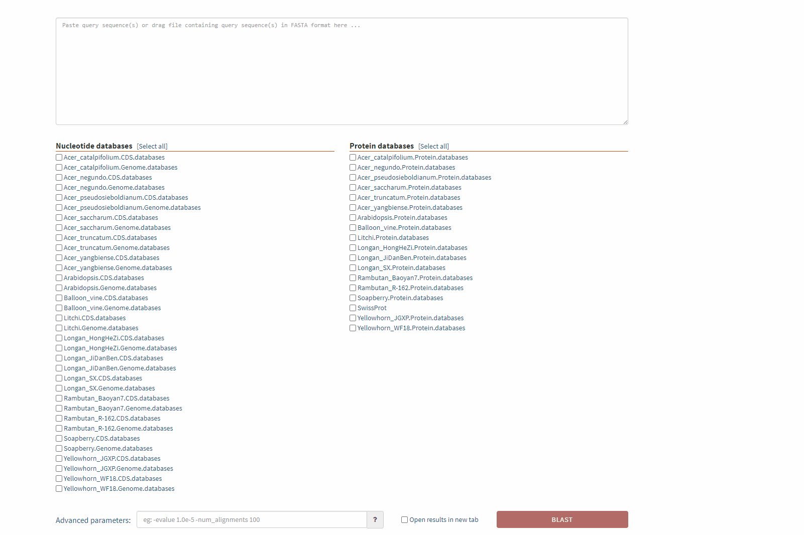
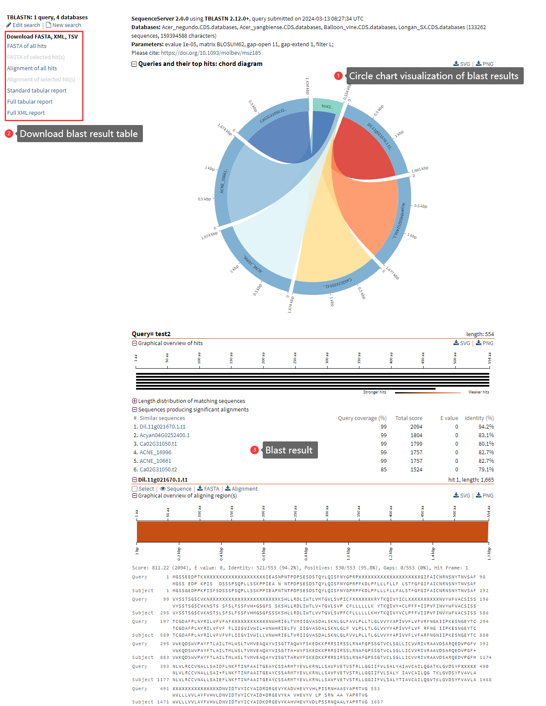
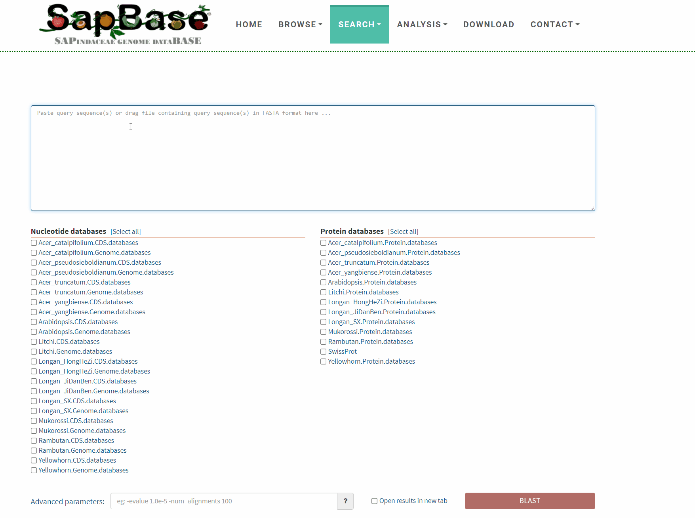

# Blast

The <mark style="color:red;">**BLAST**</mark> function enables users to input nucleic acid or protein sequences for analysis. It supports the selection of established nucleic acid or protein libraries of Sapindaceae species for alignment, including CDS library, genome library, and protein library. Additionally, the SwissProt library has been added to the protein library to support gene function annotation of any sequence. The BLAST function will automatically determine whether it is a nucleic acid sequence or a protein sequence based on the user's input, and automatically select a matching BLAST mode.

### Input file format <a href="#input-file-format" id="input-file-format"></a>

Input a single nucleic acid or protein sequence in the input box. Multiple sequence input (fasta format) is supported. It also supports users to upload data by dragging and dropping files.

Example of single sequence input:

```
ATGAAAAGACTAGTCTCTCCAACAAAAAACTTATCTCCAGGCTACCTGGGTTTCTTGCTT
CAAAAATGCATGAAATGCAAGGCCTTGAAACCAGGAAAGCAAGTTCATGCTTTGTTATTG
TTGACCAATATTTCTTTCAACTCCAAGCTTGTTGGCATGTACGCGAGTTGTGGAAATGTC
AGGTCTGCGCGCTTGGTGTTCGATGAAATTCCCAACCCAAACGTTTTCGCTGTGAATTGG
ATGGTTTTGGCCTCCGCTTATAATGGGGACTTCGAAGAGGCAATTGGGTACTTATCGTTG
ATGCGAGACTCGATGAAATCATGCAACAAGTTTACGTTTTCGATCGTGTTAAAAGCTTGC
GTTGGTTTGCTTGATTTGAAGAAAGGAAAACAAGTTCATTCAATTGTGAACAAAATGGGT
TTTGAGAGTGATGTCTCAGTTGGTAATGCTTTGATTGATATGTATTGTAAATGCGGACAT
TTGAGTTATGGTCGTAGAGTGTTTGATAAAATGGTTAACAGAGATGTTGCTTCTTGGACT
TCAATGATTTGTGGGTATTGTAACACAGGAAAGGTTGAGCAAGCGATGGTTTTGTTTGAA
AGGATAAGGTTGGAAGGCTTAGAACCTAACGATTTCACGTGGAATGCGATGATAGCTGGC
TATGCTAGGAGAGGTGATACCAATGGAGCATTTGAGATTTTCTCTAGGATGTCTGCACAT
GGTCTGGTTCCTGATTTGGTCACTTGGAATGCCATGATTTCAGGTTTCACTCAAAGCCAG
CGAGCTGATGAAGCTTTTACATTGTTTCGGGCAATGTTAGTTGCTGGGGTCAAACCGAAT
CTTGTAACTGTCACGGGACTGCTTCCGGCTTGTGGGCTGACAGTTTCGATTCGAAGAGGT
AGAGAAATTCAGGGATGGATACATAGGATGGGGCTTGATATTAATGTATTTGTTGGTAGT
GCTCTTATTGACATGTATTCAAAATGTGGGAGTGTGAAAGATGCTAGGAATGTGTTTGAC
```

or protein sequence:

```
MKRLVSPTKNLSPGYLGFLLQKCMKCKALKPGKQVHALLLLTNISFNSKLVGMYASCGNV
RSARLVFDEIPNPNVFAVNWMVLASAYNGDFEEAIGYLSLMRDSMKSCNKFTFSIVLKAC
VGLLDLKKGKQVHSIVNKMGFESDVSVGNALIDMYCKCGHLSYGRRVFDKMVNRDVASWT
SMICGYCNTGKVEQAMVLFERIRLEGLEPNDFTWNAMIAGYARRGDTNGAFEIFSRMSAH
GLVPDLVTWNAMISGFTQSQRADEAFTLFRAMLVAGVKPNLVTVTGLLPACGLTVSIRRG
REIQGWIHRMGLDINVFVGSALIDMYSKCGSVKDARNVFDMIYAKNVASWNAMIGCYGKH
GMVDASMELFERMQEEGMQPNEVTFIAVLSACSHGDLVEKGLKIFRSMKETYGVEISKEH
YACVVDMLCRSGKMVEAYELVRGMPIEITNSIAGAFFNGCKIHGRRDLAKMMAEECLTMD
LKKPGAFVTLSNIYAADGEWHQVENLRNIMKEKNVHKKPGFSWVEKNVTFFEK*
```

Example of multiple sequences input:

```
>test1
MKRLVSPTKNLSPGYLGFLLQKCMKCKALKPGKQVHALLLLTNISFNSKLVGMYASCGNV
RSARLVFDEIPNPNVFAVNWMVLASAYNGDFEEAIGYLSLMRDSMKSCNKFTFSIVLKAC
VGLLDLKKGKQVHSIVNKMGFESDVSVGNALIDMYCKCGHLSYGRRVFDKMVNRDVASWT
SMICGYCNTGKVEQAMVLFERIRLEGLEPNDFTWNAMIAGYARRGDTNGAFEIFSRMSAH
GLVPDLVTWNAMISGFTQSQRADEAFTLFRAMLVAGVKPNLVTVTGLLPACGLTVSIRRG
REIQGWIHRMGLDINVFVGSALIDMYSKCGSVKDARNVFDMIYAKNVASWNAMIGCYGKH
GMVDASMELFERMQEEGMQPNEVTFIAVLSACSHGDLVEKGLKIFRSMKETYGVEISKEH
YACVVDMLCRSGKMVEAYELVRGMPIEITNSIAGAFFNGCKIHGRRDLAKMMAEECLTMD
LKKPGAFVTLSNIYAADGEWHQVENLRNIMKEKNVHKKPGFSWVEKNVTFFEK*
>test2
MGSSEEDPTKPISLYDSSSPSQPLLSSKPPIEASNPNTPDPSESDSTQYLQISFNYGPRP
FKDLPFLLLFLLFVLSTFGFGIFAICNRNSNYTNVSAFVYSSTSGSCVKNSTSPSFSLFS
SFVHVGSGFSLSKSHLLRDLIWTLVMTGVLSVPICFLLLLLLKRYTKQIVYICLPFFIII
PVFINVYWFVACSISSTCGDAFPLAYRILVFVFAFLIIGVIVWILVVNWHRIELTVMIIG
VASDALSKNLGLFAVLPLLTLGLVVYYAPIVVFLVFVRFNGKIIPKESNGEYTCVWKQDS
WVPAYFTLAILTMLWSLTVMVEAQAYVISGTTAQWYFSKEDKKPRRSIRSSLRNAFGPSS
GTVCLSGLLICVVRIVRAAVDSARQEDVPGFVNLVLRCCVNALLSAIDFLNKFTINFAAI
TGEAYCSSARMTYEVLKRNLLSAVFVETVSTRLLGGIIFVLSALYAIAVCAILQGATKLG
VDSYFVAVLAWVLLLVVLAYFVHVLDNVIDTVYICYAIDRDRGEVYKADVHEVYVHLPIS
RNHAASYAPRTVGA.
```

Example of drag-and-drop file upload sequence:

<figure><figcaption></figcaption></figure>

### Output file format <a href="#output-file-format" id="output-file-format"></a>

After BLAST is completed, an interactive results page will be returned, and users can choose to download or visualize the corresponding results as needed.

<figure><figcaption></figcaption></figure>

Demo:

<figure><figcaption></figcaption></figure>
