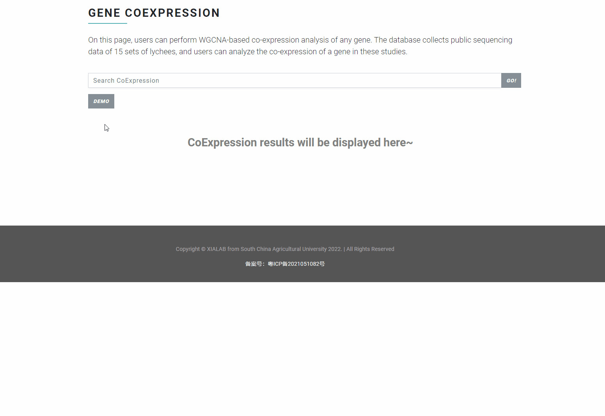

# Gene Coexpression

In "Gene Coexpression" function, users can perform **WGCNA-based co-expression analysis** of any gene. The database collects public sequencing data of 15 sets of lychees, and users can analyze the co-expression of a gene in these studies.

### Input file format <a href="#input-file-format" id="input-file-format"></a>

Input any gene ID to search, for example:

```
LITCHI002021
```

<figure><figcaption></figcaption></figure>

### Output file format <a href="#output-file-format" id="output-file-format"></a>

The search results display the co-expression of the retrieved genes in each study. Additionally, the tool provides visualizations of gene co-expression networks and tables containing detailed information on co-expressed genes.

<figure><figcaption></figcaption></figure>
