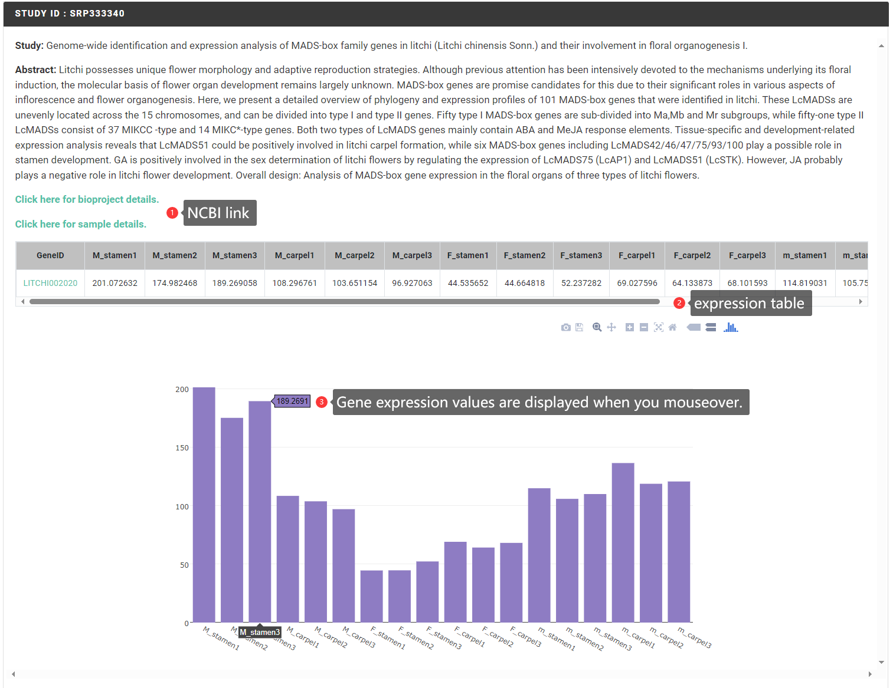
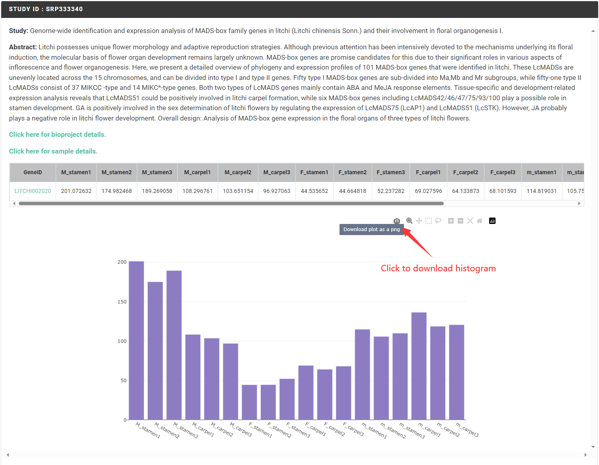

# Multiple Experiment Comparison

The "Multiple Experiment Comparison" function collects gene expression profiles from publicly published RNA-seq data in the SRA database, allowing users to query the expression of any gene in all included transcriptome data. In this project, Sapbase have normalized the transcriptomic data using the Transcripts Per Million (TPM) method. TPM is a commonly used metric for gene expression that effectively eliminates the influence of sequencing depth and transcript length, allowing for direct comparisons of expression levels across different samples and genes.

### Mode 1: Single gene query <a href="#mode-1-single-gene-query" id="mode-1-single-gene-query"></a>

#### Input

In mode 1, the user can specify any Sapindaceae species to be queried and enter the corresponding Gene ID to query its expression in all transcriptome data.

Example of Gene ID format:

```
litchi Gene ID: LITCHI002021

longan Gene ID: Dil.09g019490

rambutan Gene ID: Nl01g14020

yellowhorn Gene ID: EVM0009016

Acer Gene ID: Acyan11G0132000

soapberry Gene ID: whz_017298-RA
```

<figure><figcaption></figcaption></figure>

#### Result

The search results display the expression of genes in different tissues or treatments in the form of study. For different study, the corresponding topics and abstracts of experimental contents are showed. In addition, two links are provided, which can jump to NCBI to browse the detailed introduction of the research project and the detailed information of each sample. Finally, histogram were used to interactively visualize gene expression in each sample, allowing users to obtain gene expression more intuitively.

<figure><figcaption></figcaption></figure>

Demo:

<figure><figcaption></figcaption></figure>

### Mode 2: Multi-gene search <a href="#mode-2-multi-gene-search" id="mode-2-multi-gene-search"></a>

#### Input

In mode 2, users can specify any Sapindaceae species to be queried and input the corresponding gene set, one gene per line, to query the expression of all genes in all transcriptome data.

Example of Gene set format (<mark style="color:red;">**Note: one gene per line**</mark>):

```
LITCHI002020
LITCHI002021
LITCHI002022
```

<figure><figcaption></figcaption></figure>

#### Result

The search results display the expression of genes in different tissues or treatments in the form of study. For different study, the corresponding topics and abstracts of experimental contents are showed. In addition, two links are provided, which can jump to NCBI to browse the detailed introduction of the research project and the detailed information of each sample. Finally, an interactive heatmap is used to display the expression of the gene set. Mouse over to display specific gene expression values.

<figure><figcaption></figcaption></figure>

Demo:

<figure><figcaption></figcaption></figure>

### Download histogram or heatmap <a href="#download-histogram-or-heatmap" id="download-histogram-or-heatmap"></a>

<figure><figcaption></figcaption></figure>

<figure><figcaption></figcaption></figure>
