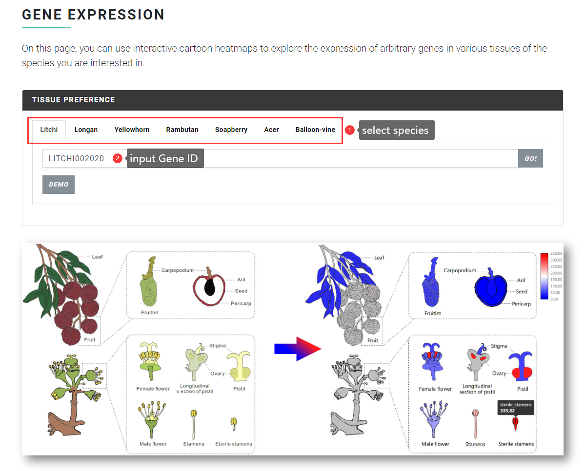
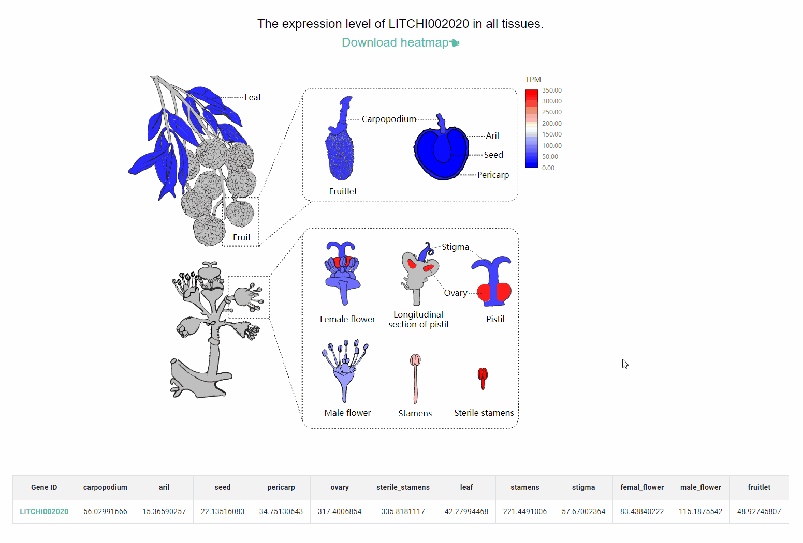

# Spatiotemporal Expression in eFP

Gene function implementation is highly correlated to its expression pattern. Currently, a great variety of interfaces for expression data exploration are available in SapBase. Spatiotemporal Expression shown in eFP (electronic Fluorescent Pictograph) is a feature function designed to intuitively **visualize gene expression** in customized pictographic representations of plants. We have constructed eFP profiles for all the seven plants. Users are enabled to analyze gene spatiotemporal distribution just by entering a single gene identifier.

### Input file format & Result 

The "Spatiotemporal Expression in eFP" function allows users to input the Gene ID of any Sapindaceae species and query the expression of the gene in various tissues.

<figure><figcaption></figcaption></figure>

Demo:

<figure><figcaption></figcaption></figure>
