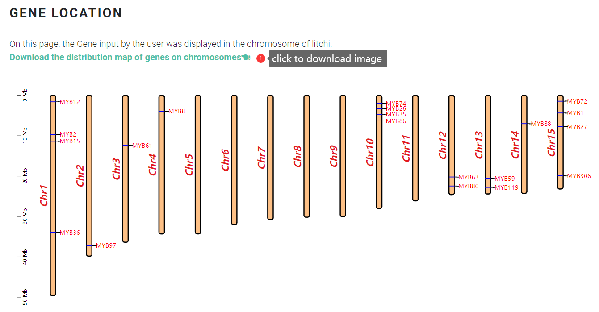

# Gene Location Viewer

In "Gene Location Viewer" function, user can map the chromosomal distribution of genes in the six sapindaceae species that are included in the database. The user needs to select a species and specify which genes to display, one gene per line, in the format of **"FeatureName,ChrID,StartPos,EndPos"** or input the **Gene ID**. In addition, the user can set the genes to be highlighted, one gene per line (optional).

### Input file format <a href="#input-file-format" id="input-file-format"></a>

First, user need to specify the species for which you want to map the distribution of genes on the chromosomes. Then, input a list of genes that need to be plotted (single gene or multiple genes). "Gene Location Viewer" supports two input modes:

#### Mode 1

Input the gene name, chromosome ID, start position, and end position (e.g. MYB12,Chr1,1599787,1602178). Note the use of commas as delimiters, one data per line.&#x20;

For example:

```
MYB12,Chr1,1599787,1602178
MYB2,Chr1,9684799,9686132
MYB15,Chr1,11344679,11346570
MYB36,Chr1,33952672,33954239
MYB74,Chr10,1997395,2009458
MYB26,Chr10,3248427,3250585
MYB35,Chr10,4678448,4680660
MYB86,Chr10,6323389,6325364
MYB63,Chr12,20216165,20218100
MYB80,Chr12,22447846,22448554
MYB59,Chr13,20577086,20578594
MYB119,Chr13,22774869,22777098
MYB88,Chr14,7012728,7023732
MYB72,Chr15,1438550,1440928
MYB1,Chr15,4363196,4367713
MYB27,Chr15,7756763,7757909
MYB306,Chr15,19921078,19923547
MYB97,Chr2,37209478,37212491
MYB61,Chr3,12372100,12374632
MYB8,Chr4,3924111,3926118
```

#### Mode 2

Directly input the Gene ID, and the program may automatically obtain the coordinates of the input gene and draw them.&#x20;

For example:

```
LITCHI002020
LITCHI002021
LITCHI002022
LITCHI002023
LITCHI002024
LITCHI002025
LITCHI002026
```

### Output file format <a href="#output-file-format" id="output-file-format"></a>

<figure><figcaption></figcaption></figure>
