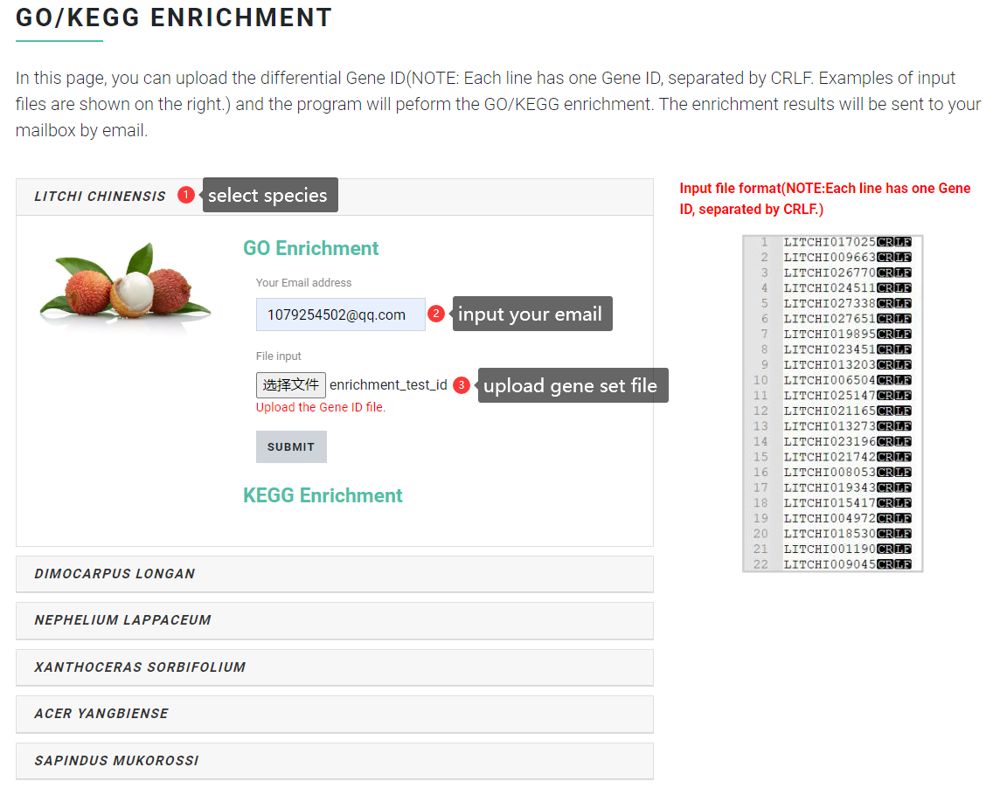
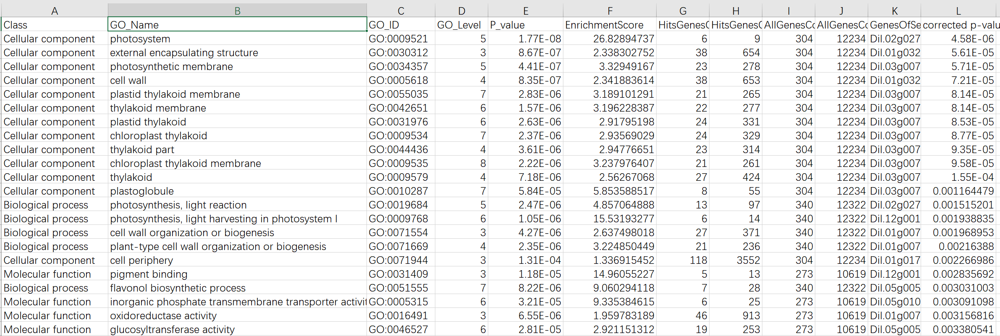
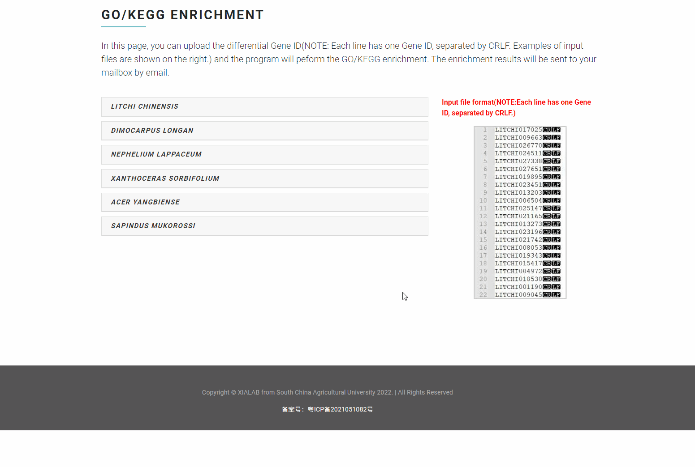

# Gene Set Function Analysis

In the "Gene Set Function Analysis" function, users can specify the Sapindaceae species to be analyzed and upload the gene set file to be enriched, with one gene per line in the file, separated by line breaks. General gene set files are obtained through gene differential expression analysis. Finally, Sapbase will automatically perform <mark style="color:red;">**GO or KEGG enrichment analysis**</mark> on the gene set uploaded by the user, and the result file will be returned to the user by email.

### Input file format <a href="#input-file-format" id="input-file-format"></a>

First, select the Sapindaceae species to be analyzed. Then, fill in the correct email address to receive the results file. Finally, upload the prepared gene set file (differential gene list) and submit it for analysis. Note that enrichment analysis may take 5 to 10 minutes, please be patient.

Example of gene collection file format (<mark style="color:red;">**One gene per line, separated by newlines**</mark>):


```
LITCHI017025
LITCHI009663
LITCHI026770
LITCHI024511
LITCHI027338
LITCHI027651
LITCHI019895
LITCHI023451
LITCHI013203
LITCHI006504
LITCHI025147
LITCHI021165
LITCHI013273
LITCHI023196
LITCHI021742
LITCHI008053
LITCHI019343
LITCHI015417
LITCHI004972
LITCHI018530
LITCHI001190
LITCHI009045
```


<figure><figcaption></figcaption></figure>

### Output file format <a href="#output-file-format" id="output-file-format"></a>

The enrichment results are sent to the user via email. Please download the result table in the email attachment. All enrichment results in the "Enrichment.final" results table are filtered by the enrichment significance threshold.

<figure><figcaption></figcaption></figure>

Demo:

<figure><figcaption></figcaption></figure>
