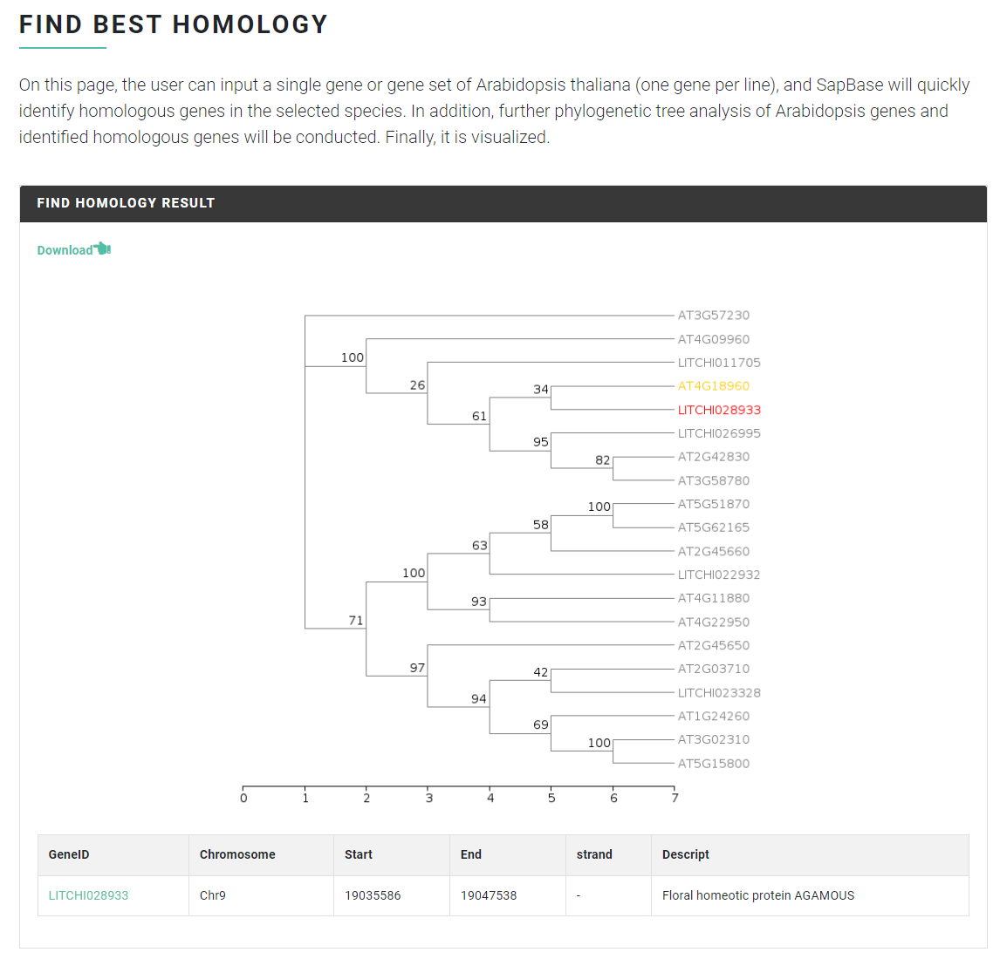
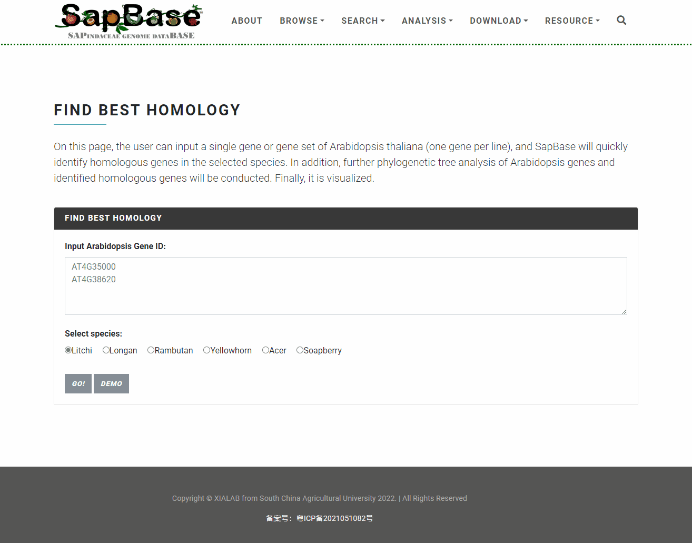

# Homolog Find

A homology inferring function allows users to <mark style="color:red;">**quickly obtain the optimal homologous gene set**</mark> for the genes of interest, which is more robust than a simple sequence BLAST search and could be used for <mark style="color:red;">**quick specific gene clade contraction-or-expansion analysis**</mark>.

### Input file format <a href="#input-file-format" id="input-file-format"></a>

In the "Homolog Find" module, users can quickly identify homologous genes in Sapindaceae species for any given Arabidopsis, rice gene, or input gene sequence. There are two supported input modes: Mode 1, directly input the gene ID of Arabidopsis or rice, the program will automatically obtain the related sequence and identify homologous genes; Mode 2, input the protein sequence.

#### Example of Mode 1:

Arabidopsis ID

```
AT4G18960
```

Rice ID

```
LOC_Os02g41510
```

#### Example of Mode 2:

input protein sequence

```
MADRIKGPWSPEEDEQLRRLVVKYGPRNWTVISKSIPGRSGKSCRLRWCN
QLSPQVEHRPFSAEEDETIARAHAQFGNKWATIARLLNGRTDNAVKNHWN
STLKRKCGGYDHRGYDGSEDHRPVKRSVSAGSPPVVTGLYMSPGSPTGSD
VSDSSTIPILPSVELFKPVPRPGAVVLPLPIETSSSSDDPPTSLSLSLPG
ADVSEESNRSHESTNINNTTSSRHNHNNTVSFMPFSGGFRGAIEEMGKSF
PGNGGEFMAVVQEMIKAEVRSYMTEMQRNNGGGFVGGFIDNGMIPMSQIG
VGRIE
```

### Output file format <a href="#output-file-format" id="output-file-format"></a>

The identification results are displayed in an evolutionary tree, with the best homologous genes highlighted in red and the query genes highlighted in yellow. Detailed information on the identified homologous genes is presented below in a table. Click the download link can download the evolutionary tree diagram.

<figure><figcaption></figcaption></figure>

Demo:

<figure><figcaption></figcaption></figure>
