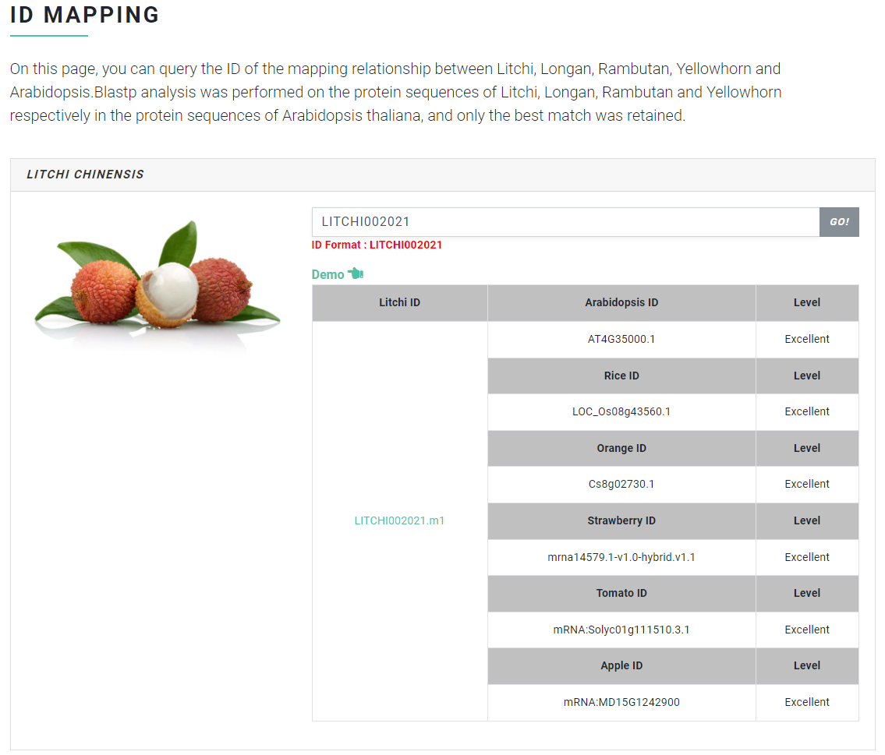

# ID Mapping

The ID mapping function allows users to quickly complete **gene mapping between different species**. Users can query the mapping of any gene ID in litchi, longan, rambutan, yellowhorn, Acer and soapberry to genes in Arabidopsis, rice, orange, strawberry, tomato and apple.

### Input file format <a href="#input-file-format" id="input-file-format"></a>

The input file is the gene ID of litchi, longan, rambutan, yellowhorn, Acer and soapberry. The specific gene ID format is as follows:

```
litchi Gene ID: LITCHI002021

longan Gene ID: Dil.09g019490

rambutan Gene ID: Nl01g14020

yellowhorn Gene ID: EVM0009016

Acer Gene ID: Acyan11G0132000

soapberry Gene ID: whz_017298-RA
```

### Output file format <a href="#output-file-format" id="output-file-format"></a>

ID mapping uses a table to display the gene mapping results. The left side is the gene input by the user, and the right side is the gene mapping result of the gene in Arabidopsis, rice, orange, strawberry, tomato and apple. It should be noted that the credibility of gene mapping has five levels, namely Excellent, Good, Average, Poor and Fair.

<figure><figcaption></figcaption></figure>
