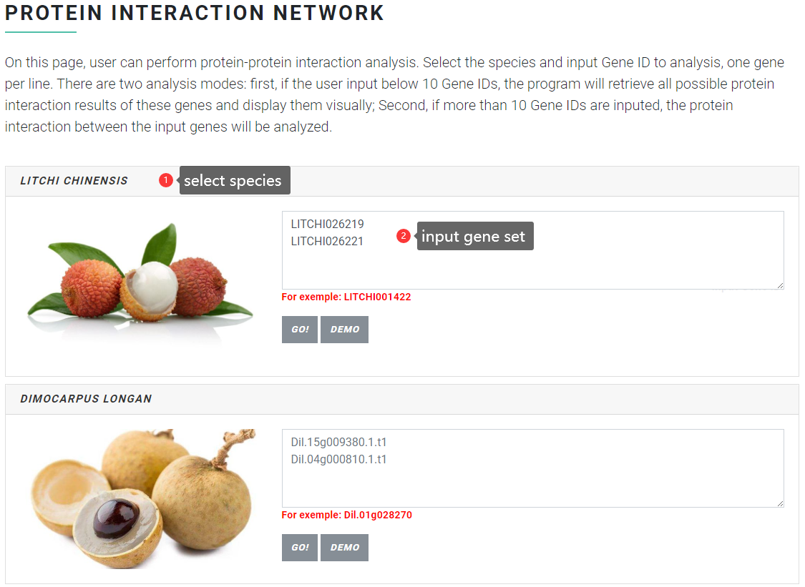
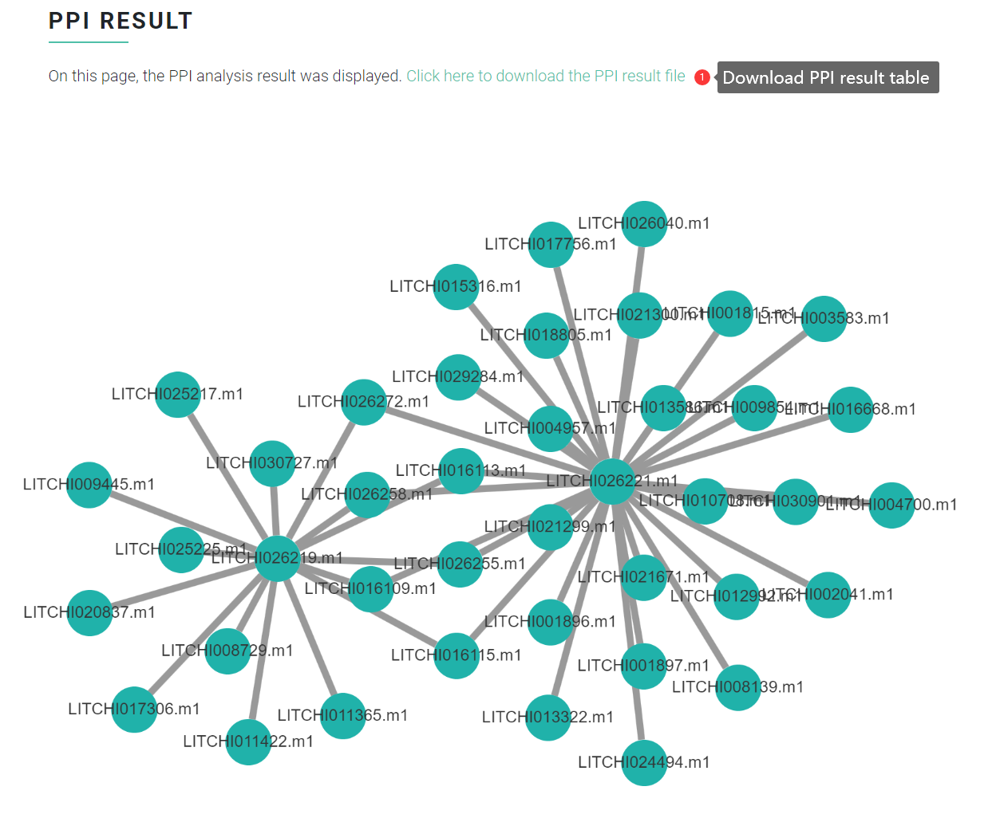
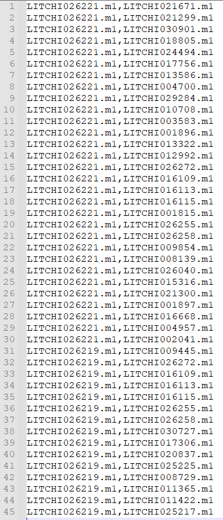

# Protein Interaction Prediction

In "Protein Interaction Prediction" function, user can perform <mark style="color:red;">**protein-protein interaction (PPI)**</mark> analysis. Select the species and input Gene ID to analysis, one gene per line. There are two analysis modes:

1. if the user input below 10 Gene IDs, the program will retrieve all possible protein interaction results of these genes and display them visually.
2. if more than 10 Gene IDs are inputed, the protein interaction between the input genes will be analyzed.

### Input file format <a href="#input-file-format" id="input-file-format"></a>

The input file is the gene ID of litchi, longan, rambutan, yellowhorn, Acer and soapberry.

For example:

```
LITCHI026219
LITCHI026221
```

<figure><figcaption></figcaption></figure>

### Output file format <a href="#output-file-format" id="output-file-format"></a>

<figure><figcaption></figcaption></figure>

The image below shows an example of a PPI analysis results table, where each row represents a pair of genes predicted to interact with each other.

<figure><figcaption></figcaption></figure>
