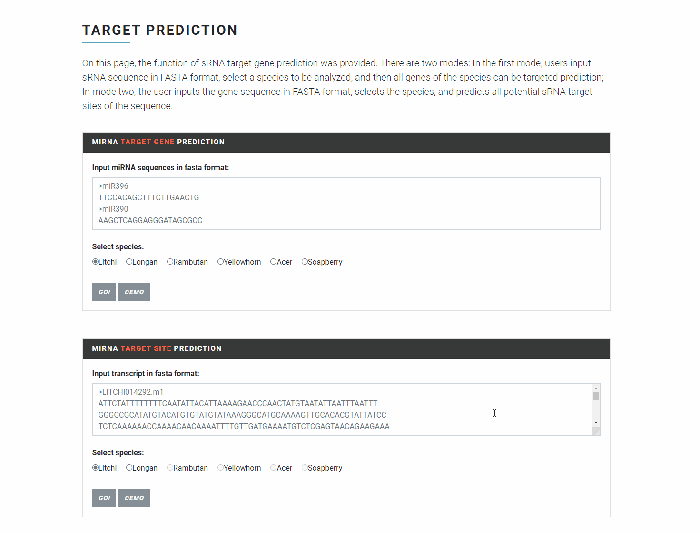
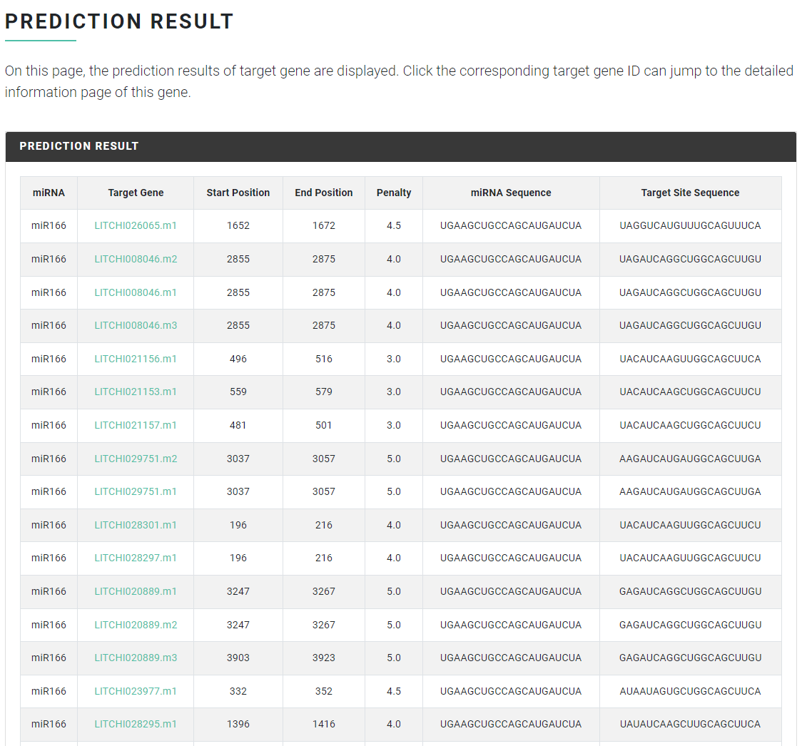
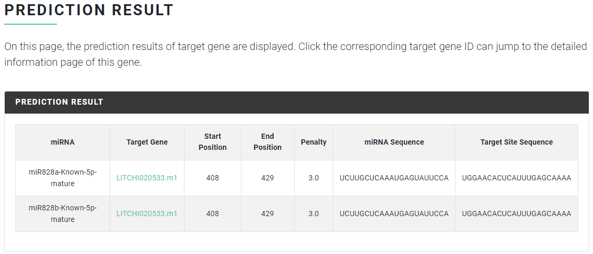

# sRNA Target Prediction

In the "sRNA Target Prediction" function, the function of <mark style="color:red;">**small RNA (sRNA) target gene prediction**</mark> is provided. There are two modes:

* Mode 1, the user inputs the sRNA sequence in FASTA format, selects the species to be analyzed, and then predicts all potential target genes in the species;
* Mode 2, the user inputs the gene sequence in FASTA format or directly input the Gene ID, and selects species, the program automatically predicts all potential sRNA targets site for the input sequence.

<figure><figcaption></figcaption></figure>

### Input file format & Result <a href="#input-file-format--result" id="input-file-format--result"></a>

#### Example of mode 1:

inputs the sRNA sequence in **FASTA format**

```
>miR166
UGAAGCUGCCAGCAUGAUCUA
>miR156
UGACAGAAGAGAGGGAGCAU
```

The result returns a list of target gene predictions, including sRNA, target Gene ID, targeted start position and end position, penalty, sRNA sequence and target site sequence.

<figure><figcaption></figcaption></figure>

#### Example of mode 2:

**inputs the gene sequence in FASTA format** or directly input the **Gene ID** (Take litchi as an example. If it is other Sapindaceae species, please input the corresponding gene ID format.)

```
>LITCHI020533
ATGACAAAGACAATCGAAAAAGAAAAAGAAAGTGAATACAAGAAAGGTTTATGGACTGTG
GAAGAAGACAAGCTACTTTCGGATTATGTACAAGTGCATGGCAAAGGACAATGGAATCGT
CTTGCCAAAAAAACAGGTTTGAAGAGATGTGGGAAAAGTTGTAGGTTAAGGTGGATGAAT
TATCTGAGTCCAAGTGTGAACAGAAGTAATTTCACTAAAGAAGAAGAAGATCTCATTATT
AGACTCCATAAGCTCCTTGGAAACAGATGGTCTTTGATTGCAAAACGAGTACCGGGACGA
ACCGACAATCAAGTGAAGAATTACTGGAACACTCATTTGAGCAAAAAGCTGGGAATCAAA
GATCAAACTCGCAGCGTTGGCGTGCTCTTGAACTCCGGCAAAGTATATGTGTCTGAGACT
AGTGTCACAGAAACATGTACCGCTTGTGATAAAAACATAAGTAGTGCAGCCACTCATATT
TTAACGGACCACAAAAGCAGCCAGAAAGCTGTGAATGTCTCGGACACACAAGATTCCATT
ATGGATGAAGGTTTCTTCAACTCCTTATGGGTGTCTGATGATGACTTGATGGAGTTTATG
GACGGTTATTCTTTAATTTGA
```

or input Gene ID

```
LITCHI020533
```

The result returns a list of prediction results of sRNA target sites in the input gene, including sRNA, target Gene ID, targeted start position and end position, penalty, sRNA sequence and target site sequence.

<figure><figcaption></figcaption></figure>
