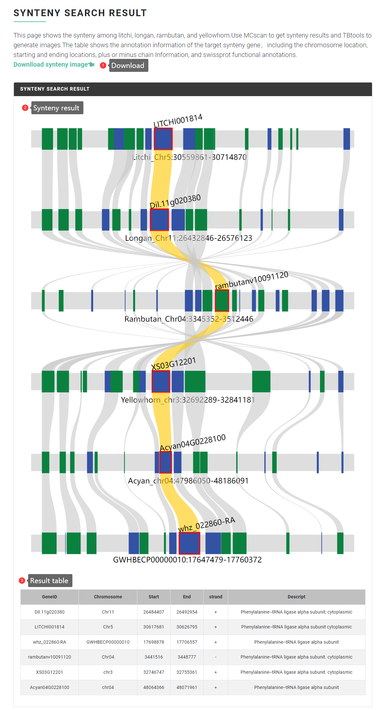

# Synteny Analysis

A synteny analysis module can be used to quickly explore the evolution and diversification of large syntenic gene blocks, which is practical for gene gain-or-loss analysis.

### Input file format <a href="#input-file-format" id="input-file-format"></a>

The input file is the gene ID of litchi, longan, rambutan, yellowhorn, Acer and soapberry. The specific gene ID format is as follows:

```
litchi Gene ID: LITCHI002021

longan Gene ID: Dil.09g019490

rambutan Gene ID: Nl01g14020

yellowhorn Gene ID: EVM0009016

Acer Gene ID: Acyan11G0132000

soapberry Gene ID: whz_017298-RA
```

### Output file format <a href="#output-file-format" id="output-file-format"></a>

The analysis results show the collinearity of the input genes across various Solanaceae species, and a table of collinear genes is provided below, including coordinates and functional annotations.

<figure><figcaption></figcaption></figure>
