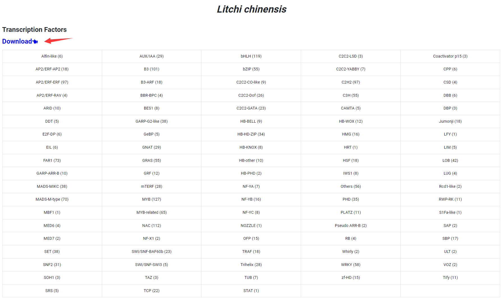

# Transcription Factors

In "Transcription Factors" module, Sapbase used iTAK software to identify transcription factor families and kinase families of Sapindaceae species (including litchi, longan, rambutan, yellowhorn, acer, mukorossi, etc.). The identification results are presented in a table, and the user can click on the name of any transcription factor family of interest to jump to a list of all genes contained in that family.

<figure><figcaption></figcaption></figure>

The "Transcription Factors" module also provides a download link for users to download the list of transcription factors or kinases for each Sapindaceae species.

<figure><figcaption></figcaption></figure>
