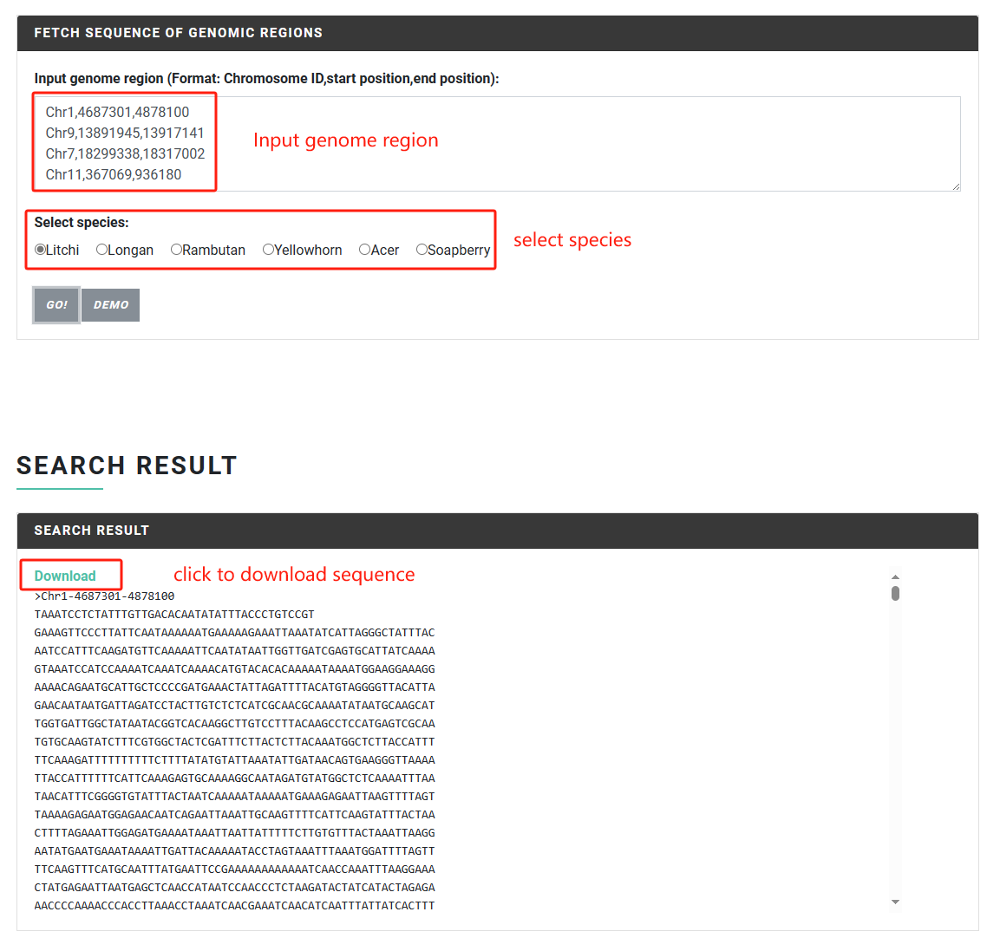

# Bulk Sequence Fetch

In the "Bulk Sequence Fetch" function, users can easily search and download the <mark style="color:red;">**gene sequences**</mark> and <mark style="color:red;">**genome interval sequences**</mark> of Sapindaceae species.

### Input file format & Result

#### **Mode 1**

Input the gene ID of any Sapindaceae species for sequence extraction, including CDS, protein, promoter, mRNA, gDNA, etc.

The input format should be **one gene per line, separated by commas.**

Example of input format:

```
LITCHI001198,
LITCHI008798,
LITCHI001966
```

<figure><figcaption></figcaption></figure>

<figure><figcaption></figcaption></figure>

#### **Mode 2**

Specify the species and input one or more genome intervals to quickly obtain the sequence of the interval. The input format is <mark style="color:red;">**chromosome ID,starting position,ending position**</mark>. Note the use of commas as delimiters, one data per line.

Example for litchi:

```
Chr1,4687301,4878100
Chr9,13891945,13917141
Chr7,18299338,18317002
```

Example for longan:

```
Chr1,4657693,4717716
Chr15,10643355,10662622
Chr3,18526335,18532893
```

Example for rambutan:

```
GWHBECQ00000001,8294047,8314385
GWHBECQ00000002,10857013,10864912
GWHBECQ00000003,10808023,10810961
```

Example for yellowhorn:

```
X.sor_LG1,16292302,16310690
X.sor_LG2,20808064,20829522
X.sor_LG8,18137033,18138537
```

Example for Acer:

```
chr01,61538411,61542561
chr02,27433954,27437789
chr08,14474626,14479064
```

Example for soapberry:

```
GWHBECP00000001,16186266,16188484
GWHBECP00000004,12767613,12773613
GWHBECP00000007,11396317,11400946
```

<figure><figcaption></figcaption></figure>
