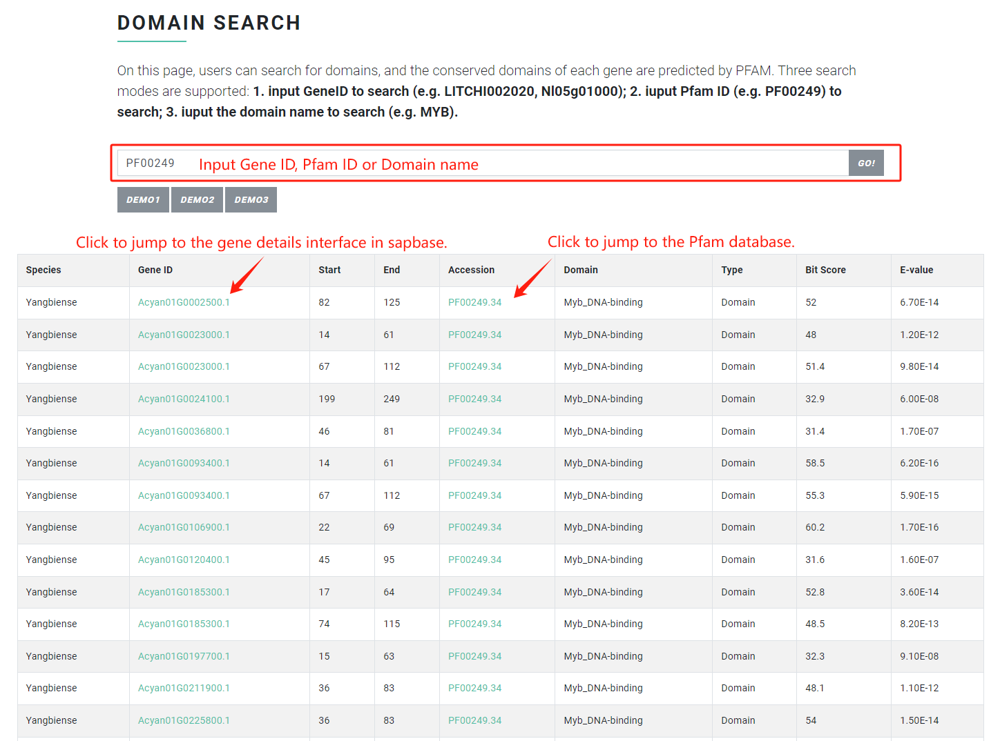

# Domain Search

In "Domain Search" function, users can search for domains, and the conserved domains of each gene are predicted by PFAM. Three search modes are supported:&#x20;

1\. input GeneID to search (e.g. LITCHI002020, Nl05g01000);&#x20;

2\. iuput Pfam ID (e.g. PF00249) to search;&#x20;

3\. iuput the domain name to search (e.g. MYB).

### Input file format <a href="#input-file-format" id="input-file-format"></a>

#### Mode 1

Input G**ene ID** of any Sapindaceae species to search.

For example:

```
litchi Gene ID: LITCHI002021

longan Gene ID: Dil.09g019490

rambutan Gene ID: Nl01g14020

yellowhorn Gene ID: EVM0009016

Acer Gene ID: Acyan11G0132000

soapberry Gene ID: whz_017298-RA
```

#### Mode 2

Input **Pfam ID** to search, and the results will return genes predicted by Pfam to have this conserved domain.

For example:

```
PF00249
```

#### Mode 3

Input **the name of the conserved domain** to search, and the results will return genes predicted by Pfam to have this conserved domain.

For example:

```
MYB
```

### Output file format <a href="#output-file-format" id="output-file-format"></a>

The search results return a table. The first column is the species name, the second column is the gene ID, the third column is the starting position of the conserved domain, the fourth column is the termination position of the conserved domain, and the fifth column is Pfam ID, the sixth column is the conserved domain name, the seventh column is the conserved domain type, the eighth column is the Bit Score, and the ninth column is the E-value.

<figure><figcaption></figcaption></figure>
