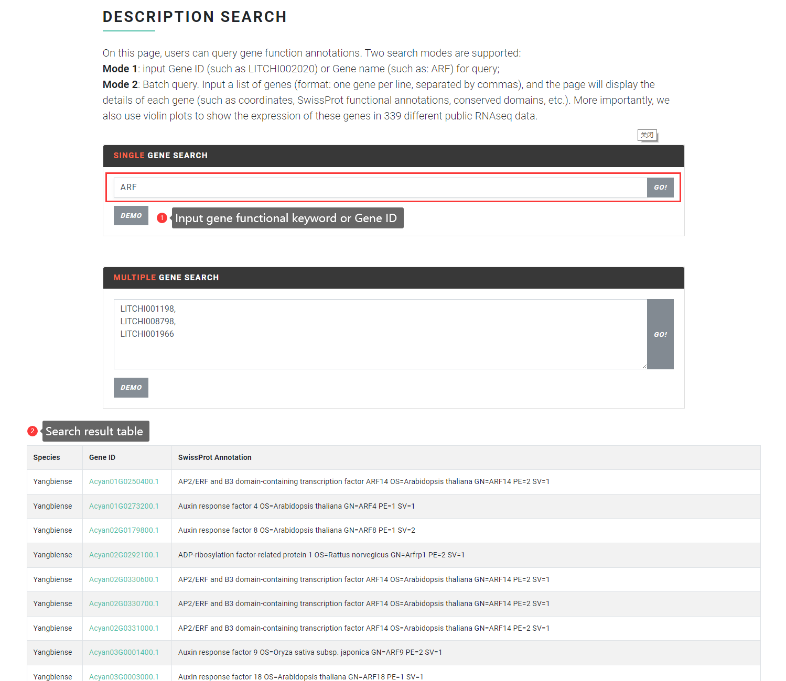
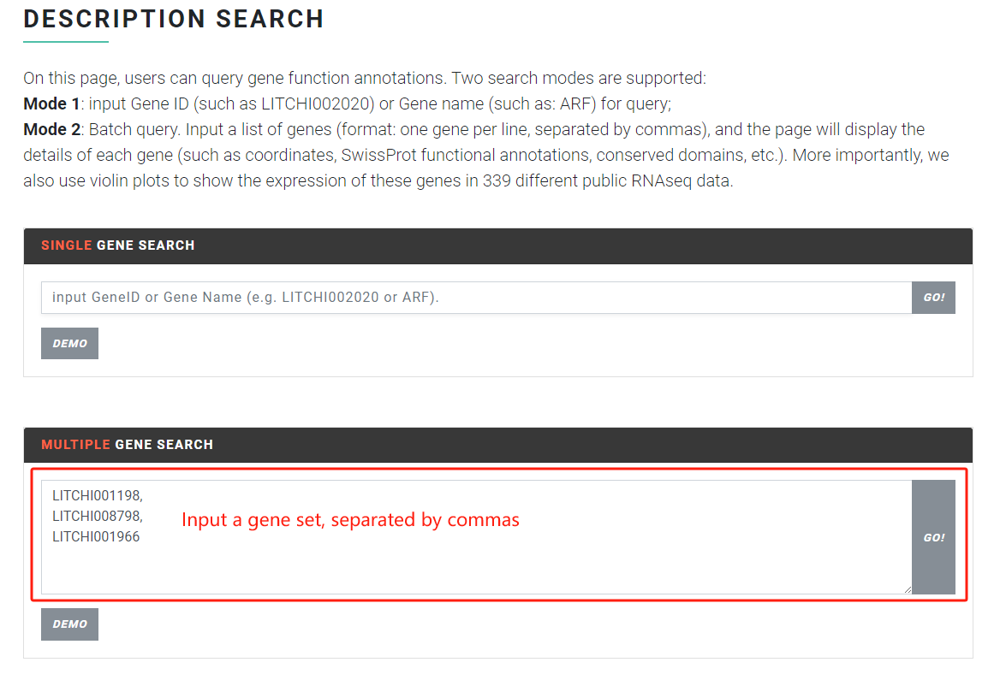

# Functional Description

The "Functional Description" function allows users to perform a fuzzy search across all species based on arbitrary annotation information, such as MYB, auxin response factor, and more. This function supports two search modes: single gene search and multi-gene search.

### Input file format & Search result <a href="#input-file-format--search-result" id="input-file-format--search-result"></a>

#### Mode 1

<mark style="color:red;">**Single gene search mode**</mark>, the user enters the keyword of any gene function (such as MYB, auxin response factor, etc.) or the gene ID (such as LITCHI002021) of Sapindaceae species to search. The search results will return a results table, the first column is the species name, the second column is the species gene ID (click to jump to the detailed page of the gene in Sapbase), and the third column is the SwissProt annotation result.

<figure><figcaption></figcaption></figure>

#### Mode 2

<mark style="color:red;">**Multi-gene search**</mark>. This mode allows users to input multiple genes for gene function queries. The input format should be **one gene per line, separated by commas**, **or one line of genes separated by commas**.

Example of input format:

```
LITCHI001198,
LITCHI008798,
LITCHI001966
```

or

```
LITCHI002021,LITCHI008798,LITCHI001966
```

<figure><figcaption></figcaption></figure>

The search results in Mode 2 will return a result table to the user, including gene details, functional annotations, and conserved domains of the query gene. More importantly, we also use violin plots to show the expression of these genes in 339 different public RNA-seq data.

<figure><figcaption></figcaption></figure>

Demo:

<figure><figcaption></figcaption></figure>
