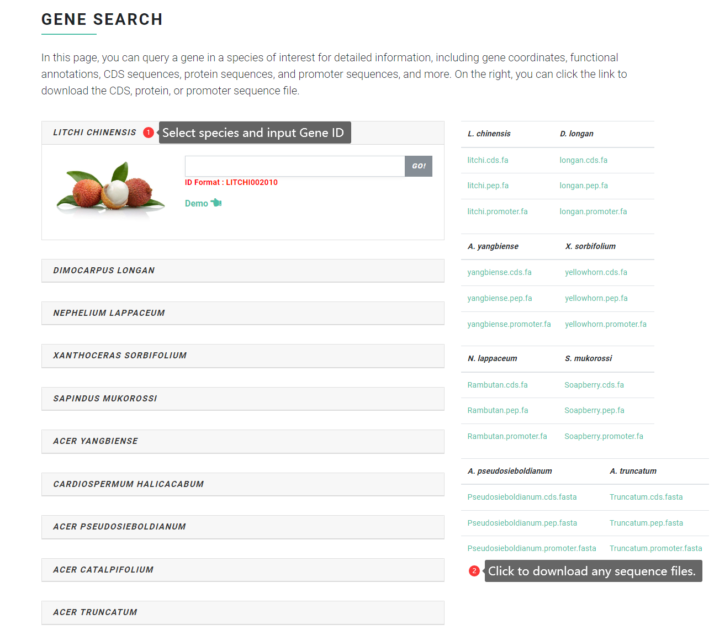

# Gene Search

In the "Gene Search" page, you can search a gene in a species of interest for detailed information, including gene coordinates, functional annotations, CDS sequences, protein sequences, and promoter sequences, and more. On the right, you can click the link to download the CDS, protein, or promoter sequence file.

### Input file format <a href="#input-file-format" id="input-file-format"></a>

Input any gene ID to query the detailed information of the gene, including coordinates, sequence, conserved domain, Swissprot functional annotation, etc. The specific input format is the gene ID of each Sapindaceae species. For example:

```
litchi Gene ID: LITCHI002021

longan Gene ID: Dil.09g019490

rambutan Gene ID: Nl01g14020

yellowhorn Gene ID: EVM0009016

Acer Gene ID: Acyan11G0132000

soapberry Gene ID: whz_017298-RA
```

<figure><figcaption></figcaption></figure>

### Output file format <a href="#output-file-format" id="output-file-format"></a>

Search results return a detailed gene information interface, including coordinates, swissProt annotation, conserved domain, CDS sequence, protein sequence, mRNA sequence, promoter sequence (2000bp sequence upstream of the gene), genome sequence, etc. All sequences support one-click copy and download.

<figure><figcaption></figcaption></figure>
