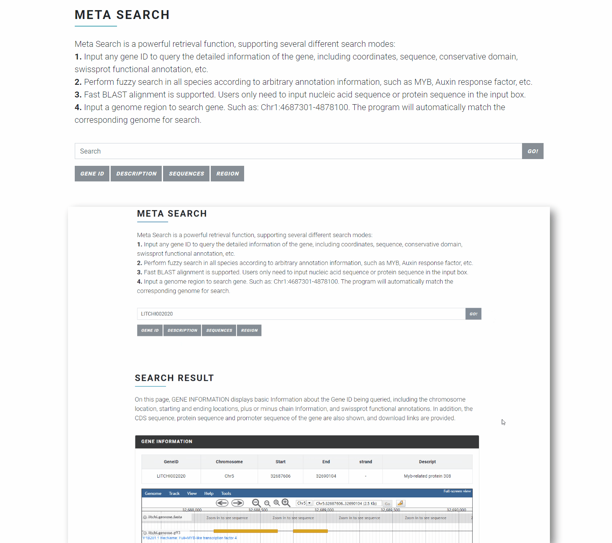
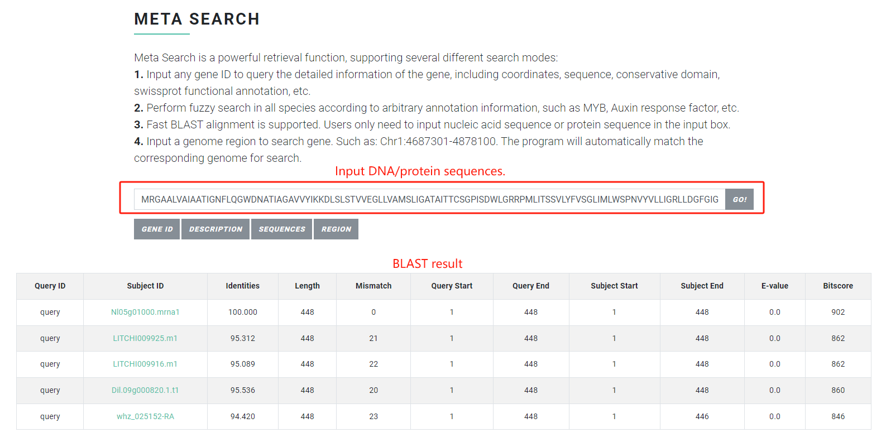
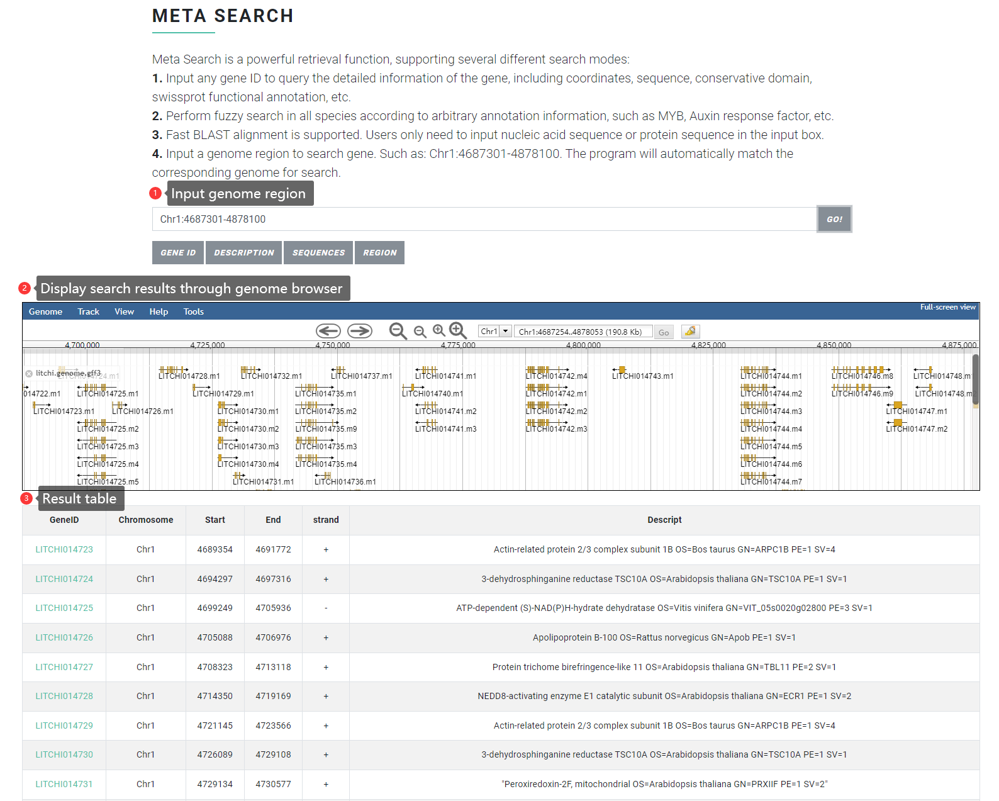

# 👍 Meta Search

To maximize the search capacity of SapBase, we designed a sophisticated “**Meta Search**” module, which provides a “**Google-like**” search function. Users are allowed to search SapBase via one text-field component using any related information, such as gene identifiers, genomic interval, gene function descriptions and even DNA/protein sequences, and SapBase will automatically identify the input content, carry out data search, and return the best matching results.

### Input file format & Search result <a href="#input-file-format--search-result" id="input-file-format--search-result"></a>

Meta Search has <mark style="color:red;">**four search modes**</mark> that correspond to different input formats.

#### Mode 1

Input any **Gene ID** to query the detailed information of the gene, including coordinates, sequence, conserved domain, Swissprot functional annotation, etc. The specific input format is the gene ID of each Sapindaceae species.&#x20;

For example:&#x20;


```
litchi Gene ID: LITCHI002021

longan Gene ID: Dil.09g019490

rambutan Gene ID: Nl01g14020

yellowhorn Gene ID: EVM0009016

Acer Gene ID: Acyan11G0132000

soapberry Gene ID: whz_017298-RA
```


Demo:

<figure><figcaption></figcaption></figure>

#### Mode 2

Perform **fuzzy search in all species according to arbitrary annotation information**, such as MYB, auxin response factor, etc. The search results will return a results table, the first column is the species name, the second column is the species gene ID (click to jump to the detailed page of the gene in Sapbase), and the third column is the SwissProt annotation result (click to jump to the SwissProt page).

For example:

```
MYB
bHLH
auxin response factor
```

<figure><figcaption></figcaption></figure>

Demo:

<figure><figcaption></figcaption></figure>

#### Mode 3

Fast **BLAST** alignment is supported. Users only need to input nucleic acid sequence or protein sequence in the input box.

For example:

```
MGSSEEDPTKPISLYDSSSPSQPLLSSKPPIEASNPNTPDPSESDSTQYLQISFNYGPRP
FKDLPFLLLFLLFVLSTFGFGIFAICNRNSNYTNVSAFVYSSTSGSCVKNSTSPSFSLFS
SFVHVGSGFSLSKSHLLRDLIWTLVMTGVLSVPICFLLLLLLKRYTKQIVYICLPFFIII
PVFINVYWFVACSISSTCGDAFPLAYRILVFVFAFLIIGVIVWILVVNWHRIELTVMIIG
VASDALSKNLGLFAVLPLLTLGLVVYYAPIVVFLVFVRFNGKIIPKESNGEYTCVWKQDS
WVPAYFTLAILTMLWSLTVMVEAQAYVISGTTAQWYFSKEDKKPRRSIRSSLRNAFGPSS
GTVCLSGLLICVVRIVRAAVDSARQEDVPGFVNLVLRCCVNALLSAIDFLNKFTINFAAI
TGEAYCSSARMTYEVLKRNLLSAVFVETVSTRLLGGIIFVLSALYAIAVCAILQGATKLG
VDSYFVAVLAWVLLLVVLAYFVHVLDNVIDTVYICYAIDRDRGEVYKADVHEVYVHLPIS
RNHAASYAPRTVGA.
```

<figure><figcaption></figcaption></figure>

#### Mode 4

Input a **genomic region** to retrieve all genes within that region. The input format is <mark style="color:green;">chromosome ID: start position-end position</mark>. Such as: litchi(Chr1:4687301-4878100), longan(longan:Chr1:4459401-4841000), rambutan(GWHBECQ00000001:8208301-8399100), yellowhorn(X.sor\_LG1:16075251-16170650), Aacer(chr01:61390501-61581300), soapberry(GWHBECP00000001:16120901-16311700). The program will automatically match the appropriate genome.

For example:

```
Chr1:4687301-4878100
```

<figure><figcaption></figcaption></figure>
